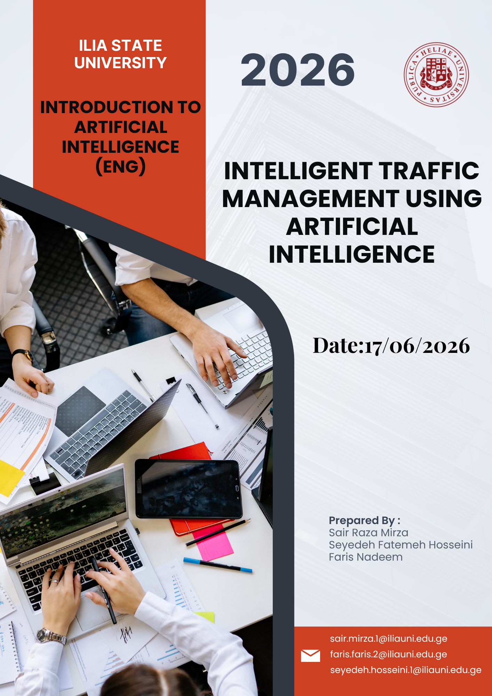
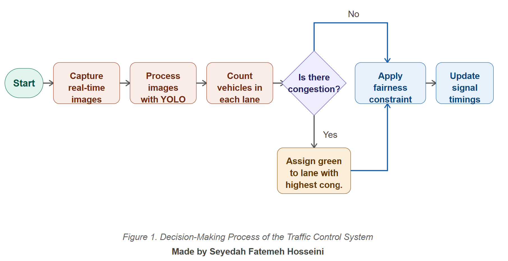
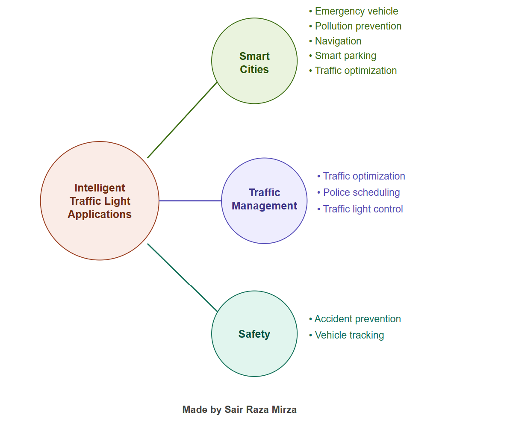
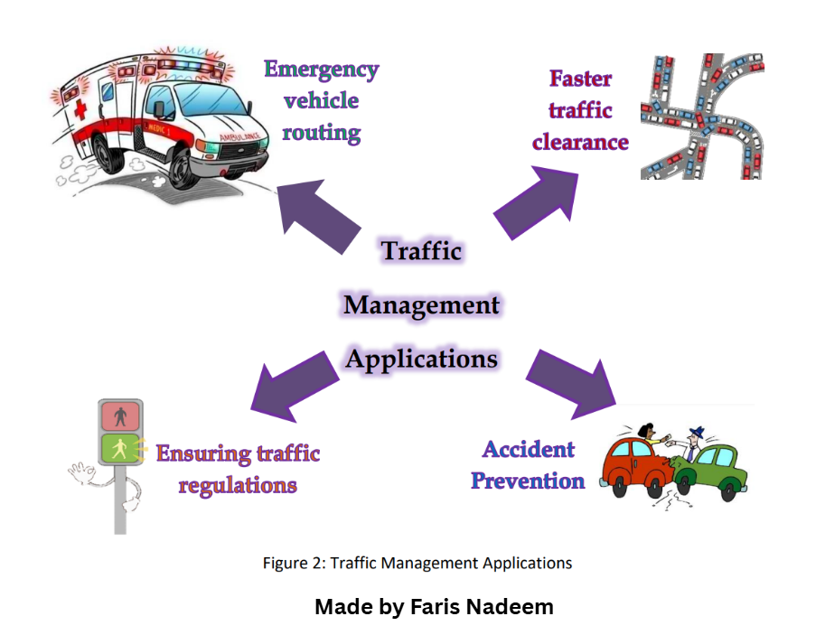

{width="8.5in" height="11.599784558180227in"}

# Abstract

Traffic congestion is a problem faced by the modern cities. Computer
vision, machine learning, and real-time decision making solutions such
as Artificial Intelligence (AI) provide advanced solutions. An AI
powered traffic management system can process traffic data, forecast
congestion patterns, and adjust light durations and manage traffic flow
to boost safety on the road. This report looks at the technology,
applications, benefits, challenges and future potential of intelligent
traffic management systems.

# Introduction

The pressure has been increasingly put on transportation infrastructure
due to the urbanization and increase in the number of vehicles.
Conventional traffic management approaches are based on predetermined
signal durations and manual oversight and monitoring, which may not be
able to adapt to traffic fluctuations. Consequently, cities suffer
congestion, fuel consumption and pollution, and delays. Artificial
Intelligence offers a smarter solution by allowing adaptive traffic
control, using real-time data. Cameras, sensors and predictive
algorithms are used in intelligent transportation systems, which help
optimize traffic and contribute to the development of smart cities.

AI is one of the most vital technologies for the modern transportation
system. AI systems can learn from the past and adapt to real-time
traffic conditions, unlike traditional traffic management methods. This
capability enables traffic management to be more effective and
efficient. With the continued growth of urban populations,
transportation networks need to become more efficient, as the demand
grows.

# Artificial Intelligence in Traffic Management

Artificial Intelligence is a technology that allows computers to
undertake tasks that normally need the intelligence of a human being. AI
is applied in transportation for traffic management, forecasting,
optimization, and automation. Together, these algorithms enable computer
vision to detect vehicles in camera feeds and machine learning to study
trends and predict congestion. Deep learning improves accuracy in object
recognition and traffic analysis.

One of the major benefits of AI is its speed in analyzing vast
quantities of data within seconds. Data is continuously being produced
by traffic cameras, traffic sensors, GPS devices and connected vehicles.
This data is then analysed by AI algorithms, which can forecast traffic
patterns, predict congestion and make recommendations for traffic
management. Machine learning models can be trained using past traffic
data to improve its accuracy over time.

# AI Technologies Used

Computer Vision can detect vehicles and pedestrians using cameras. The
Machine learning solution analyzes traffic patterns and predicts
congestion. Deep Learning enhances Recognition. The Internet of Things
(IoT) sensors give real-time information about road conditions, vehicle
movement etc. Cloud Computing is useful for processing large data sets.
These technologies comprise the core of intelligent traffic management
systems that can adapt to traffic fluctuations.

# AI-Based Smart Traffic Control Process

{width="6.0in" height="3.0875in"}

The process of intelligent traffic control system decision making is
shown in **figure 1**. Real time traffic images are captured
continuously by the cameras. Vehicle detection algorithms detect and
count vehicles in each lane. The system analyzes traffic density and
decides whether there is traffic congestion or not. Afterwards, the
traffic signals are dynamically adjusted to enhance traffic efficiency.

The process outlined in **Figure 1** illustrates the automated decision
making by intelligent traffic systems. The AI system continuously
assesses traffic density and vehicle movement, rather than depending on
human operators. Real time analysis enables traffic lights to respond
immediately to changes in traffic.

# Applications of Intelligent Traffic Systems

{width="4.708333333333333in"
height="3.919796587926509in"}

The intelligent traffic systems include traffic optimization, smart
parking management, vehicle tracking, prioritization of emergency
vehicles, traffic monitoring and pollution reduction.

The wide range of applications of intelligent traffic systems is
illustrated with examples in **Figure 2**. Smart parking systems
minimise the parking time drivers spend searching for a parking area and
vehicle tracking systems facilitate transportation planning. These
capabilities will help cities to optimize mobility and cut down on
operational costs.

# {width="4.022831364829396in" height="3.097536089238845in"}Traffic Management Applications

**Figure 3** illustrates several practical applications of AI based
traffic management systems, including emergency vehicle routing,
accident prevention, traffic regulation, and faster traffic clearance.

Based on the figure, there are several practical implementations of AI
traffic management systems, such as: AI systems can learn from traffic
patterns and identify unusual situations, potentially preventing
accidents from happening. When an ambulance or a fire service are
responding to an emergency, they can request traffic signal priority by
using the emergency vehicle routing feature which can reduce the
response time and increase public safety.

# Comparison of Traditional and AI Based Traffic Systems

  --------------------------------------------------------
     **Traditional Traffic    **AI-Based Traffic System**
           System**           
  --------------------------- ----------------------------
     Fixed signal timings        Dynamic signal timings

       Manual monitoring          Automated monitoring

      Limited prediction        Predictive analytics and
          capability                  forecasting

   Slow response to traffic   Real-time adaptive response
            changes           

   Higher congestion levels    Reduced congestion levels

    Higher fuel consumption     Improved fuel efficiency

      Increased emissions     Reduced environmental impact

   Limited emergency vehicle       Emergency vehicle
            support                  prioritization
  --------------------------------------------------------

**(Table 1: Comparison Table)**

The differences between traditional traffic management systems and AI
based traffic systems are highlighted in **Table 1**. Conventional
systems are based on predetermined signal durations and manual
monitoring, whereas AI driven systems leverage real-time data,
predictive analysis and adaptive signal control to optimize
transportation performance. These capabilities help reduce congestion,
improve fuel efficiency, and enhance road safety.

# Benefits of AI-Based Traffic Management

The benefits of having traffic management with the help of Artificial
Intelligence are numerous. Adaptive traffic control minimises congestion
and trip times which also implies to Georgia. Reducing congestion
reduces fuel consumption and greenhouse gas emissions. More efficient
traffic movement means more productivity, less transportation expenses.
AI algorithms can help in preventing accidents on the roads by
identifying dangerous situations and assisting in timely interventions.

AI systems also provide significant economic benefits, apart from the
transportation improvement. Lower travel times boost efficiency in the
supply chain and worker productivity. The overall enhanced
transportation system gives enterprises more reliable and more
convenient transportation and it gives citizens shorter and less
stressful commute times.

# Challenges and Limitations

AI driven traffic control has its advantages, but it also has its
disadvantages. Installing and maintaining AI based traffic management
systems can be expensive. Visual data is collected a lot in traffic
systems, which raises privacy concerns. Connected infrastructure must be
protected from cybersecurity risk. AI systems depend on the quality and
reliability of data and inaccurate or faulty data can affect their
performance.

# Case Study of Smart Cities

AI is already being analyzed and being used successfully in traffic
management in a number of cities around the world. In **Singapore**,
real time monitoring systems, predictive analytics and adaptive traffic
control are used to improve transportation efficiency. **London** has
traffic lights that can adapt. **Dubai** has been deploying a range of
smart city technologies including AI enabled transport systems. The
examples show that AI powered traffic management solutions are a proven,
viable tool that is already making a difference in large cities across
the globe.

# Future Developments

In the future, intelligent transportation systems will include
autonomous vehicles, vehicle to infrastructure communication and 5G
networks. Traffic authorities will be able to use advanced predictive
analytics to predict congestion before it happens. AI powered transport
systems will play a growing role in smart city initiatives that seek to
enhance mobility and sustainability.

# Conclusion

AI is revolutionising city traffic through real time monitoring,
predictive analytics, and adaptive signal control. Smart traffic
management systems can alleviate congestion, improve safety, reduce
emissions and improve overall efficiency of transportation. As
urbanisation continues to expand, AI driven traffic management will
become increasingly important in building smarter, more sustainable
cities.

# References

1\. Kamble, V. B., Mundhe, O. N., Walunjkar, C. M., & Kale, G. A.
(2025). AI-Driven Smart Traffic Management System: An Adaptive Approach
Using YOLO and OpenCV. <https://ijmsm.org/ijmsm-v2i2p106.html>

2\. Elbasha, A. M., & Abdellatif, M. M. (2025). AIoT-based Smart Traffic
Management System. <https://arxiv.org/abs/2502.02821>

3\. Intelligent Traffic Management System using Computer Vision and
Machine Learning.
<https://www.researchgate.net/publication/374717408_Intelligent_Traffic_Management_System_using_Computer_Vision_and_Machine_Learning>

5\. Liu, G., Shi, H., Kiani, A., Khreishah, A., Lee, J. Y., Ansari, N.,
Liu, C., & Yousef, M. (2021). Smart Traffic Monitoring System using
Computer Vision and Edge Computing. <https://arxiv.org/abs/2109.03141>

6\. Goenawan, C. R. (2024). Autonomous Smart Traffic Management System
Using Artificial Intelligence CNN and LSTM.
<https://arxiv.org/abs/2410.10929>

7\. Samuel, P., & Sharma, P. K. (2025). Intelligent Traffic Management
System using Artificial Intelligence and Computer Vision: Review.
<https://ijrt.org/j/article/view/486>

8\. Sherifi, S. (2026). Intelligent Traffic Monitoring with YOLOv11: A
Case Study in Real-Time Vehicle Detection.
<https://arxiv.org/abs/2604.04080>

9\. Artificial Intelligence in Smart Traffic Management Systems.
<https://www.preprints.org/manuscript/202502.0539>
